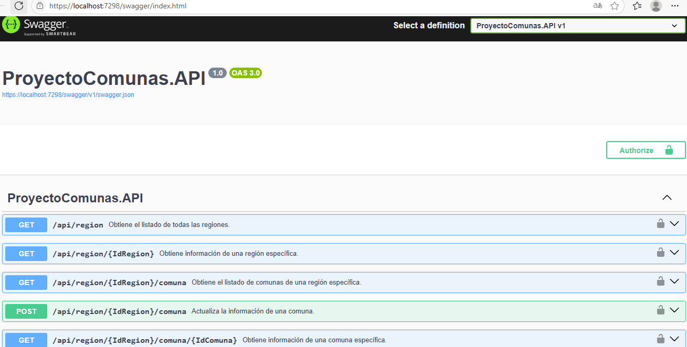
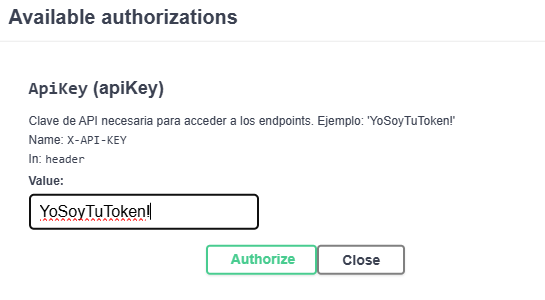
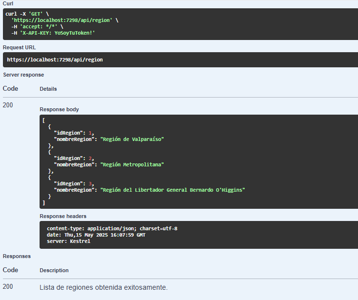

# Proyecto Comunas de Chile

Este es un proyecto simple desarrollado en **.NET 8** que permite consultar las regiones y comunas de Chile. Además, incluye la funcionalidad para editar las comunas. El proyecto está dividido en tres capas principales: **Datos**, **API** y **Web**.

## Estructura del Proyecto

### 1. **Datos**
Biblioteca de clases para la conexión a una base de datos **SQL Server**. Este proyecto se encarga de consumir procedimientos almacenados para realizar las operaciones necesarias.  
**Estado actual:**
- La conexión está configurada para SQL Server LocalDB.
- Todas las operaciones de lectura y actualización se realizan mediante procedimientos almacenados.

### 2. **API**
Servicio **REST API** que utiliza el proyecto **Datos** para exponer los resultados en formato **JSON**.  
**Características:**
- Implementa una **API Key configurable** para la autenticación básica.
- Incluye registro de logs para monitorear las operaciones.

### 3. **Web**
Capa de presentación desarrollada en **ASP.NET Core Razor Pages**, con una estructura y diseño similar a **.NET Core 3.1**.  
**Estado actual:**
- Consume los servicios REST de la API.
- La configuración de la API se mantiene fuera de los controladores.

## Scripts de Base de Datos
Los scripts necesarios para crear la base de datos y los procedimientos almacenados se encuentran en la carpeta `T-SQL`.

## Tecnologías Utilizadas
- **.NET 8** para todos los proyectos.
- **SQL Server** como base de datos (pendiente de implementación).
- **NLog** para el registro de logs en los proyectos **API** y **Datos**.

## Configuración
Los nombres de los procedimientos se encuentran en `ProyectoComunas.API/appsettings.json`.
Si la base usa otra nomenclatura, se modifican allí sin cambiar el código C#.

## Cómo Ejecutar el Proyecto
1. Clonar este repositorio.
2. Configurar el entorno de desarrollo con **Visual Studio 2022**.
3. Ejecutar los proyectos en el siguiente orden:
   - Ejecutar los scripts de la carpeta `T-SQL`.
   - Iniciar **API**.
   - Iniciar **Web**.

---

## 🧪 API - Pruebas con Swagger (OpenAPI)

Este proyecto incluye documentación interactiva de la API mediante **Swagger (OpenAPI)**. Puedes usar esta interfaz para:

- Ver todos los endpoints disponibles
- Probar directamente las consultas desde el navegador
- Agregar autenticación con un token para acceder a los métodos protegidos

### 🔐 Token para pruebas

Para consumir los endpoints protegidos, debes ingresar el siguiente token en Swagger UI:

```
YoSoyTuToken!
```

Haz clic en el botón **Authorize** (candado), pega el token y luego realiza tus pruebas.

### 📸 Capturas de Swagger UI

- **📋 Endpoints disponibles:**

  

- **🔑 Ingreso del Token:**

  

- **🌍 Consumo del endpoint de regiones:**

  

---

¡Gracias por revisar este proyecto! Si tienes sugerencias o mejoras, no dudes en contribuir.
